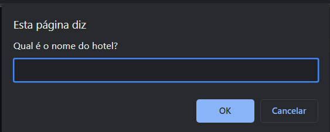
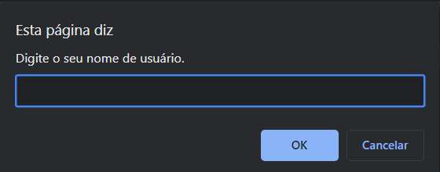
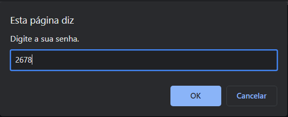
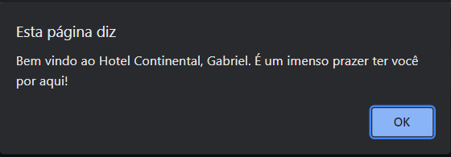
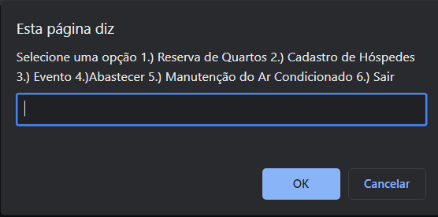

# Hotel para Terabithia
Olá! Bem vindo ao repositório do meu projeto de Hotel para Terabithia, uma atividade proposta pelo professor Gabriel Augusto no Instituto PROA.

## Sobre o projeto
<div>




  
</div>

### Descrição do projeto
Nesse projeto, deviamos criar um código em javascript para um sistema de hotel com funcionalidades para auxiliar um funcionário.

### Construção do projeto
Para a realização do projeto, foram utilizados: HTML e JavaScript.

<div style='{display:flex}'>
  <a href='https://developer.mozilla.org/pt-BR/docs/Web/HTML' target='_blank'>
    
  </a>
  <a href='https://developer.mozilla.org/pt-BR/docs/Web/JavaScript' target='_blank'>
    
  </a>
</div>

## Como acessar o projeto?
### Acessando pelo computador

### Pré-requisitos

Para navegar no projeto no seu computador, é preciso ter instalado:

1. Qualquer navegador que suporte JavaScript.

* Chrome
  ```sh
  https://www.google.com/intl/pt-BR/chrome/
  ```

### Instalação

1. Baixe o respositório
2. Abra a pasta 'HOTEL'
3. Execute o arquivo 'Hotel.html'

### Importante!

Você pode inserir qualquer nome de usuario e de hotel, porém a senha para acessar é sempre: "2678".
